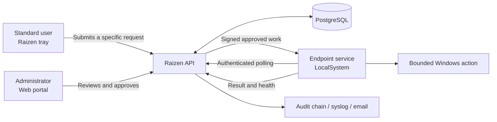

<p align="center">
  
</p>

<h1 align="center">Raizen</h1>

<p align="center">
  Brokered Windows administration with approval workflows, endpoint monitoring, diagnostics, and an auditable execution trail.
</p>

<p align="center">
  <a href="https://github.com/ZachariasSavvas/Raizen-OpenSource/releases/latest"></a>
  <a href="LICENSE.md"></a>
  
  
</p>

Raizen gives standard Windows users a controlled way to request privileged actions without handing out persistent local administrator rights. An administrator reviews each request in the web portal, and the endpoint service executes only the approved, strongly typed action.

It is designed for self-hosted and air-gapped environments. The server, database, endpoint service, tray application, installers, and update tooling are all included in this repository.

> [!IMPORTANT]
> Raizen executes privileged operations as `SYSTEM`. Evaluate it in a lab, review the security configuration, and establish an approval policy before deploying it to production endpoints.

## Why Raizen?

Traditional elevation often means giving users a local admin account or opening an unrestricted remote shell. Raizen takes a narrower approach:

- users request a specific action with a reason;
- the server validates the action and its parameters;
- one or more administrators approve or deny it;
- the endpoint claims and executes that exact request;
- the result is recorded in a tamper-evident audit trail.

There is no general-purpose remote terminal and no permanent elevation token.

## Features

| Area | Capabilities |
|---|---|
| Approval workflow | Pending review, approval and denial, comments, parameter validation, multi-approver rules, scheduled execution, bulk operations, expiry, and optional policy-based auto-approval |
| Windows actions | MSI installation/removal, service control, local group membership, file operations, registry values, local users, certificates, firewall rules, network settings, environment variables, permissions, and approved application launches |
| Endpoint visibility | Online state, agent version, update health, uptime, CPU, memory, disk, IP addresses, logged-on user, Defender, BitLocker, reboot state, processes, and Windows services |
| Monitoring | Built-in health rules, custom service rules, alert acknowledgement, per-rule severity, email routing, and removable rules |
| Diagnostics | Approved collection of bounded Windows event-log bundles with redaction, SHA-256 verification, download controls, and seven-day expiry |
| Audit and reporting | Append-only HMAC hash chain, actor and endpoint history, CSV/XLSX/PDF exports, syslog forwarding, and notification history |
| Deployment | Windows setup wizard, endpoint MSI, self-update support, in-place server upgrades, air-gapped packages, and uninstall/reset tooling |

## How it works



The user-facing tray runs without elevation. The Windows service is the privileged boundary and accepts work only through the authenticated request lifecycle.

## Supported endpoint actions

Raizen currently includes handlers for:

- installing and uninstalling MSI packages;
- starting, stopping, and restarting Windows services;
- adding or removing local group members;
- copying and deleting approved files;
- setting approved registry values;
- executing hash-pinned approved scripts;
- creating and disabling local users;
- installing trusted root certificates;
- enabling or disabling Windows Firewall rules;
- configuring IPv4, gateways, DNS, and DHCP;
- managing system environment variables;
- changing file and folder permissions through the Windows security UI;
- launching approved `.exe`, `.msi`, and `.msc` files with elevation;
- collecting approved Windows event-log diagnostic bundles.

Actions are implemented as individual handlers. Raizen intentionally does not expose an unrestricted shell action.

## Security model

Raizen is built around explicit trust boundaries:

- **Endpoint authentication:** each endpoint has a unique machine identity and API key.
- **Signed polling:** approved work returned to an endpoint is signed and verified before execution.
- **TLS:** production traffic is encrypted; endpoints can use the Windows trust store or certificate pinning.
- **Server-side validation:** action parameters, approval state, endpoint ownership, expiry, and execution state are checked outside the UI.
- **Least capability:** endpoint handlers implement bounded operations rather than accepting arbitrary commands.
- **Tamper evidence:** audit records form an HMAC hash chain and the PostgreSQL table is protected against normal update/delete operations.
- **Secret handling:** production configuration, certificates, private keys, endpoint configuration, and license files are excluded from source control.
- **Air-gapped operation:** normal runtime behavior does not require an external cloud service.

See [SECURITY.md](SECURITY.md) for the vulnerability reporting process and production expectations.

## Quick start

### 1. Download the release

Download the latest assets from [GitHub Releases](https://github.com/ZachariasSavvas/Raizen-OpenSource/releases/latest):

- `RaizenServer-<version>.zip` — complete Windows server package;
- `RaizenServer-Setup-<version>.exe` — standalone setup wizard;
- `RaizenEndpoint-<version>.msi` — endpoint service and tray installer;
- `SHA256SUMS-<version>.txt` — release checksums.

Verify the downloaded files against the checksum manifest before installation.

### 2. Install the server

Server requirements:

- Windows Server 2019 or 2022 x64;
- local administrator rights;
- PostgreSQL 15 or later;
- 4 GB RAM and 40 GB available disk as a practical minimum;
- inbound access to the configured API and portal ports (defaults: `5001` and `5002`).

Extract the server ZIP, then run `RaizenServer-Setup.exe` as Administrator. The wizard configures PostgreSQL, TLS, signing and encryption keys, the API, the portal, Windows services, and firewall rules.

The default local account is `Admin` / `Admin` and must be changed immediately after the first sign-in.

### 3. Install an endpoint

Endpoint requirements:

- Windows 10/11 or Windows Server 2019/2022 x64;
- administrator rights for installation;
- outbound HTTPS access to the Raizen API.

Run `RaizenEndpoint-<version>.msi` as Administrator, configure the server address, and register the endpoint from the portal. The MSI installs:

- `RaizenEndpoint`, an automatic Windows service running as `LocalSystem`;
- the non-elevated Raizen tray application;
- Explorer request actions for supported files and folders;
- protected configuration and log directories under `%ProgramData%\Raizen`.

For full deployment and hardening guidance, read [DEPLOYMENT.md](DEPLOYMENT.md).

## Upgrading

The Windows release package includes `Update-RaizenServer.ps1`. From an elevated PowerShell session:

```powershell
.\Update-RaizenServer.ps1 `
  -PackageDir "C:\Path\To\RaizenServer-1.5.9" `
  -AgentVersion "1.5.9" `
  -Force
```

The update workflow preserves production configuration, certificates, licenses, and PostgreSQL data. The endpoint MSI is copied to the server update location so registered endpoints can receive the new agent version.

Pilot upgrades on a small endpoint group before a broad rollout.

## Building from source

Development requirements:

- Windows 10/11 or Windows Server;
- .NET 8 SDK;
- PostgreSQL for integration and local server testing;
- WiX Toolset 4 for MSI packaging;
- PowerShell 5.1 or later.

Clone and validate:

```powershell
git clone https://github.com/ZachariasSavvas/Raizen-OpenSource.git
cd Raizen-OpenSource

dotnet build Raizen.sln
dotnet test tests\Raizen.Tests\Raizen.Tests.csproj
```

Build the full Windows release package:

```powershell
.\scripts\Build-WindowsServer.ps1 -Version "1.5.9"
```

Output is written to:

```text
release\RaizenServer-1.5.9\
  RaizenServer-Setup.exe
  api\
  web\
  agent\RaizenEndpoint.msi
  postgres\
  Update-RaizenServer.ps1
  Reset-RaizenServer.ps1
  Uninstall-RaizenServer.ps1
```

## Repository layout

```text
src\Raizen.Shared                         Shared contracts and enums
src\Raizen.Server\Raizen.Server.Core     Database model and domain services
src\Raizen.Server\Raizen.Server.Api      Endpoint/admin API
src\Raizen.Server\Raizen.Server.Web      Blazor admin portal
src\Raizen.Server\Raizen.Server.Setup    Windows server setup wizard
src\Raizen.Endpoint\Raizen.Endpoint.Service  Privileged endpoint service
src\Raizen.Endpoint\Raizen.Endpoint.Tray     User tray application
tests\Raizen.Tests                       xUnit test suite
scripts                                   Build, update, repair, and release tooling
docs                                      Deployment and test documentation
```

## Configuration and operational paths

| Purpose | Default location |
|---|---|
| Server installation | `C:\Program Files\Raizen\Server` |
| Endpoint installation | `C:\Program Files (x86)\Raizen` or `C:\Program Files\Raizen` |
| Endpoint configuration and logs | `%ProgramData%\Raizen` |
| Server API service | `RaizenApi` |
| Server portal service | `RaizenWeb` |
| Endpoint service | `RaizenEndpoint` |

Production secrets belong in `appsettings.Production.json` or protected endpoint configuration, never in the repository.

## Contributing

Contributions are welcome, especially focused fixes with tests.

1. Fork the repository and create a feature branch.
2. Keep shared contracts in `Raizen.Shared`, domain behavior in `Raizen.Server.Core`, and privileged execution in a bounded endpoint handler.
3. Add or update tests in `tests/Raizen.Tests`.
4. Run the build and complete test suite.
5. Open a pull request describing the security impact and validation performed.

Changes that introduce a privileged endpoint action should include strict parameter validation, denial-path tests, and must not add a generic shell or persistent administrative session.

## License

Raizen is available under the [MIT License](LICENSE.md).

## Project status

Raizen is actively developed. It is suitable for evaluation and controlled deployments, but privileged administration software always requires environment-specific hardening, monitoring, backups, and an incident response plan.
